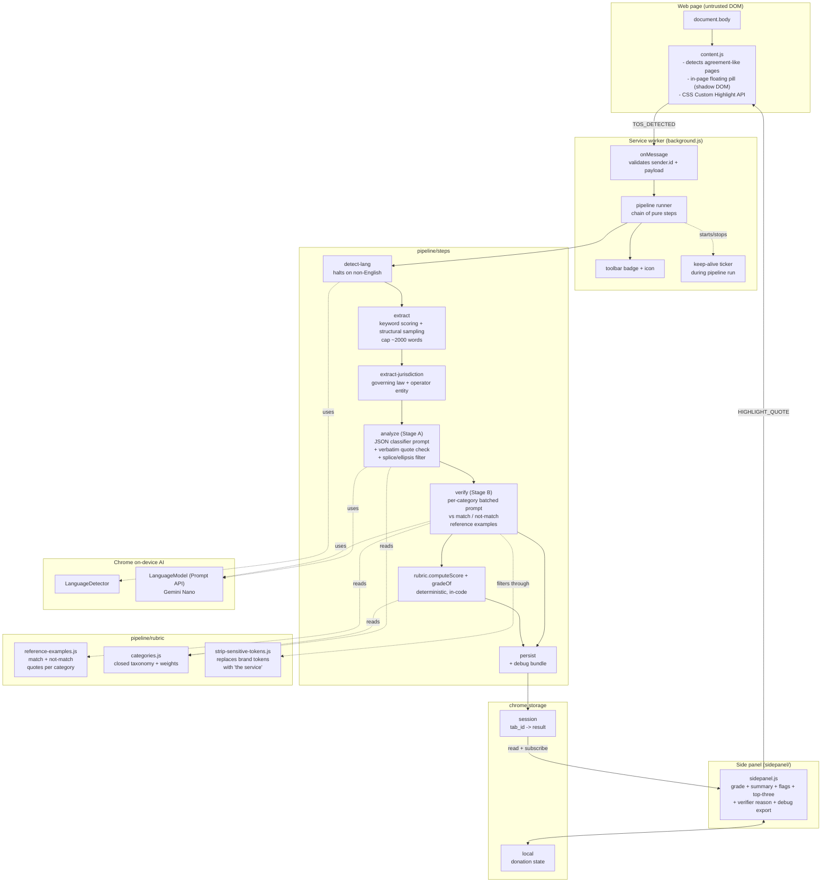

# Assent

> Reads agreement documents so you don't have to. Highlights potentially unfavourable clauses before you accept.

Assent is a Chrome extension that scans Terms of Service, EULAs, privacy policies, and similar agreement documents. It produces a letter grade (A-F), a deterministic numeric risk score, a short neutral summary, and a list of flagged clauses with verbatim quotes so every finding can be checked against the original document.

The extension runs **entirely on the user's device** using Chrome's built-in Gemini Nano. There are no servers, no API keys, no telemetry, no logins, no costs.

The MVP scope is **English-language documents only**. Documents in other languages are detected and the side panel shows an "English-only for now" state. Multilingual support is on the roadmap.

## Why

Most people click "I Agree" without reading thirty pages of legalese. The provisions that matter - mandatory arbitration, broad content licences, automatic training on user content, indefinite data retention, unilateral termination, broad indemnity - are usually buried where they will not be found. Assent surfaces them with a verbatim quote so the reader can verify each finding directly against the original document.

## How it works

```
content.js          detects an agreement document on the current page, or
                    one linked from a consent context (sign-up, registration),
                    and posts TOS_DETECTED to the background.
   │
   ▼
background.js       runs the pipeline:
   │
   ├─ detect-lang           Chrome LanguageDetector; if the document is not English
   │                        the pipeline halts with unsupportedLanguage
   ├─ extract               keyword-weighted section extraction, capped at ~2000 words,
   │                        with structural sampling across four document zones so a
   │                        risky tail clause is not lost in a long document
   ├─ extract-jurisdiction  regex finds governing law and operator entity,
   │                        classified as eu / non-eu / unknown
   ├─ analyze               Chrome Prompt API (Gemini Nano) classifies clauses into a
   │                        closed taxonomy and returns verbatim quotes; high recall by design
   ├─ verify                second Prompt-API pass per category, compared against
   │                        curated match / not-match reference examples; rejects misclassifications
   └─ persist               chrome.storage.session, keyed by tab id
   │
   ▼
the side panel and the in-page floating pill render the result;
clicking a flag in the side panel highlights the verbatim quote in the
original page.
```

The first call to the on-device model downloads a small Chrome model bundle; every subsequent call is offline.

## Requirements

- **Chrome 148 or later** on desktop. The Prompt API has been enabled by default on desktop since Chrome 148 (May 2026). Translator and Language Detector have been stable since Chrome 138. Mobile Chrome does not expose any of these APIs.
- For the on-device language model bundle:
  - macOS 13+, Windows 10/11, or a desktop Linux distribution
  - GPU with >4 GB of VRAM, **or** 16 GB of RAM with a 4+ core CPU
  - approximately 22 GB of free disk space for the model bundle

If the model is unavailable on the current device, the extension reports an "analysis unavailable" state instead of producing a result.

## Roadmap

The MVP focuses on English-language documents and a single audit-hardened pipeline. Items on the roadmap that are deliberately not shipped in the MVP:

- Multilingual analysis. Non-English detection is kept as a first-class pipeline signal (`unsupportedLanguage`) so support can be added later by re-introducing translate-in / translate-out steps and expanding `_locales/`.
- Region-aware phrasing. The user-region helper (`extension/src/features/user-region.js`) still detects reader region from timezone and locale, but the analyze prompt currently only uses it as neutral context. A future release may adjust tone based on this signal.
- Regulator-aware badges. The extension deliberately never names a regulation or law; a post-MVP feature could offer an optional user-controlled overlay that surfaces general information about applicable consumer-rights frameworks.

## Install (development)

1. Clone this repository.
2. Open `chrome://extensions/` and enable Developer Mode.
3. Choose **Load unpacked** and select the `extension/` folder (not the repository root).
4. Click the Assent toolbar icon to open the side panel.
5. Visit any agreement document; the side panel and the floating pill on the page will populate when analysis completes.

For a step-by-step local test guide, including how to provision the on-device model bundle, see [TESTING.md](TESTING.md).

## Architecture



| Path                                    | Purpose                                                                                            |
| --------------------------------------- | -------------------------------------------------------------------------------------------------- |
| `extension/manifest.json`               | Manifest V3 with i18n placeholders, service worker, content script, side panel                     |
| `extension/_locales/en/messages.json`   | UI string catalogue (English only for MVP)                                                         |
| `extension/icons/`                      | Toolbar and store icons (16/32/48/128 px PNG)                                                      |
| `extension/src/background.js`           | Service worker; pipeline orchestrator, badge, overlay, keep-alive, fetch guard                     |
| `extension/src/content.js`              | DOM detection, in-page floating pill (shadow DOM), click-to-highlight                              |
| `extension/src/pipeline/index.js`       | Generic chain-of-responsibility runner                                                             |
| `extension/src/pipeline/context.js`     | Builds the per-run context (user region, progress callback)                                        |
| `extension/src/pipeline/steps/`         | The six pipeline steps (detect-lang → extract → extract-jurisdiction → analyze → verify → persist) |
| `extension/src/pipeline/rubric/`        | Closed taxonomy, deterministic scoring, reference examples, sensitive-token strip                  |
| `extension/src/features/top-three.js`   | Selects the most material flags for the summary header                                             |
| `extension/src/features/donation.js`    | Local-only donation prompt timing and PayPal link                                                  |
| `extension/src/features/user-region.js` | Passive detection of the reader's region from timezone and locale                                  |
| `extension/src/shared/url-safety.js`    | SSRF-resistant URL sanitiser used by background fetch                                              |
| `extension/src/sidepanel/`              | Side panel HTML/CSS/JS                                                                             |
| `tests/`                                | Node `--test` unit tests for the rubric, url safety, verifier, and repair paths                    |

Every pipeline step is a pure async function `(input, ctx) => { value, done? }`. Steps may short-circuit, throw (the orchestrator wraps the error with the step name), or pass through. Adding a new step does not require modifying existing ones.

## Methodology

Assent performs **automated text-pattern detection only**. The on-device model classifies clauses into a closed taxonomy. The score is computed deterministically in code from those classifications using the rubric below.

### Pipeline

1. Chrome's on-device LanguageDetector reads the raw document. If it is confidently non-English the pipeline halts and the side panel shows the "English-only for now" state. This keeps English-tuned keyword extraction from silently mangling foreign-language documents.
2. The page text is reduced to its most risk-relevant sections by a deterministic keyword filter, capped at roughly 2000 words. The extractor reserves part of the budget for structural sampling, so a risky clause near the document tail is not dropped in favour of a denser head.
3. Declared governing law and operator entity are extracted by regex to provide neutral, internal jurisdiction context (`eu` / `non-eu` / `unknown`).
4. **Stage A - analyze.** The text is passed to Chrome's on-device language model with `temperature: 0`, `topK: 1`, and a JSON-Schema `responseConstraint` that pins service type, category, severity, and quote fields to their closed enums. The model identifies clauses, assigns each one a category from the published taxonomy, and returns a verbatim quote and a severity tag (`high` / `full` / `partial`). The system prompt uses strictly negative disambiguation and forbids quoting any phrasing that did not appear in the user input, to discourage the model from echoing canonical legal boilerplate.
5. Each returned quote is verified to be a verbatim substring of the input text after Unicode normalisation, and quotes that contain ellipsis or omission markers are rejected. These are hallucination defences, not classification rules. If at least three flag candidates came back but none survived this check, the result is marked `lowRecall=true` and the side panel surfaces a confidence notice instead of presenting a clean grade.
6. **Stage B - verify.** Candidates are grouped by category. A single verifier session is created and reused across categories. For each category the model gets a second, narrower prompt that contains the category definition and match / not-match reference quotes from `pipeline/rubric/reference-examples.js`. The model returns `{ match, reason }` for every candidate. Non-matches are dropped. Every kept reason is passed through `strip-sensitive-tokens.js`, which replaces any occurrence of the analysed site's brand-shaped tokens with "the service". Verbatim quotes are deliberately not touched. The verifier fails open: if the second pass throws or returns malformed JSON the candidate is kept and tagged `verifierFailed` so the bug is visible in the debug bundle.
7. A numeric score is computed from the verified classifications using the rubric. The score is mapped to a letter grade by fixed thresholds.
8. Titles and the short summary are rendered from internal i18n strings keyed off the category id. Verbatim quotes and reference examples are never translated.

### Rubric

Each detected clause contributes a fixed number of points based on its category. Severity modifies the contribution: `high` ×1.5, `full` ×1.0, `partial` ×0.5. Positive ("credit") clauses subtract points. The bonus from credits is capped at `max(8, penalty × 0.4)` to prevent a small number of good clauses from washing out material flags. The final score is `clamp(round(penalty − cappedBonus), 0, 100)`.

The full taxonomy lives in `extension/src/pipeline/rubric/categories.js`. The current weights are:

| Category                            | Kind   | Weight |
| ----------------------------------- | ------ | ------ |
| `broad_content_license_irrevocable` | flag   | 18     |
| `data_resale_undisclosed_parties`   | flag   | 16     |
| `mandatory_arbitration`             | flag   | 15     |
| `class_action_waiver`               | flag   | 14     |
| `unilateral_terms_change_no_notice` | flag   | 14     |
| `broad_indemnity_from_user`         | flag   | 12     |
| `broad_data_sharing_third_party`    | flag   | 8      |
| `broad_limitation_of_liability`     | flag   | 8      |
| `account_termination_no_notice`     | flag   | 8      |
| `auto_renewal_no_clear_optout`      | flag   | 7      |
| `broad_warranty_disclaimer`         | flag   | 7      |
| `content_removal_sole_discretion`   | flag   | 6      |
| `retention_period_undefined`        | flag   | 5      |
| `governing_law_distant_venue`       | flag   | 4      |
| `services_as_is`                    | flag   | 4      |
| `other_unfavourable_clause`         | flag   | 3      |
| `easy_account_deletion`             | credit | 6      |
| `explicit_refund_window`            | credit | 6      |
| `user_retains_content_ownership`    | credit | 6      |
| `explicit_optin_data_sharing`       | credit | 5      |
| `arbitration_optout_window`         | credit | 5      |
| `free_data_export`                  | credit | 4      |
| `no_automatic_renewal`              | credit | 4      |
| `transparent_retention_period`      | credit | 4      |

### Grade thresholds

| Score  | Grade |
| ------ | ----- |
| 0-8    | A     |
| 9-22   | B     |
| 23-44  | C     |
| 45-65  | D     |
| 66-100 | F     |

The rubric is calibrated against `tests/fixtures/synthetic-tos/corpus.json`, a hand-authored set of 30 synthetic Terms of Service profiles spread across all five bands. Any change to weights or thresholds must keep that corpus passing - see `tests/rubric-corpus.test.js`.

No information about the analysed document or its publisher is hard-coded into the extension. The extension makes no editorial claim about any specific organisation; it reports what the on-device model detected in the text supplied to it at runtime.

## Scripts

```sh
npm test           # node --test on tests/*.test.js (pure unit tests, no AI)
npm run lint       # eslint on extension/src and tests
npm run format     # prettier write
npm run format:check
npm run zip        # builds assent-<version>.zip ready for the Chrome Web Store
```

`npm test` covers the deterministic scoring rubric, label resolution, and the summary template. It does not call any AI; for end-to-end testing with the real on-device model see [TESTING.md](TESTING.md).

## Privacy

Assent does not phone home. It does not collect or transmit any analytics, telemetry, identifiers, or document content. Results are stored only in `chrome.storage.session` (the analysed tab) and `chrome.storage.local` (donation state only). Both are local to the user's browser profile.

The service worker's `fetch` for a linked ToS URL sends `referrer-policy: no-referrer`, disables the cache, resolves each redirect manually, caps the response at 1.5 MB, and refuses any content type other than `text/html`, `text/plain`, and `application/xhtml+xml`. The URL sanitiser rejects `file://`, `javascript:`, `data:`, RFC 1918 / CGNAT / loopback / link-local addresses in every notation (decimal, hex, octal, dotted, IPv4-mapped IPv6, cloud-metadata hostnames).

## Important legal notice

Read carefully before using this extension.

- The output of this extension is produced by an automated text-pattern detector. It is **not** legal advice, **not** a legal opinion, **not** a substitute for professional review, and **not** a factual assertion about any organisation.
- The extension is **independent** and is **not affiliated, endorsed, sponsored, or otherwise associated** with any organisation whose document may be analysed.
- The extension does **not** maintain any list, ranking, or rating of named third parties. It analyses only the text supplied to it at the moment of use, on the user's own device.
- Risk scores reflect patterns in language and do not capture every legal nuance. Scores and flags may be incomplete, mistaken, or otherwise inaccurate. Users should always read the original document in full.
- The extension is provided "AS IS" without warranties of any kind, as set out in the [LICENSE](LICENSE) file.

If you are an organisation that believes a specific output of this extension is materially inaccurate as applied to your document, please open an issue describing the document version and the language at issue.

## License

MIT - see [LICENSE](LICENSE).
